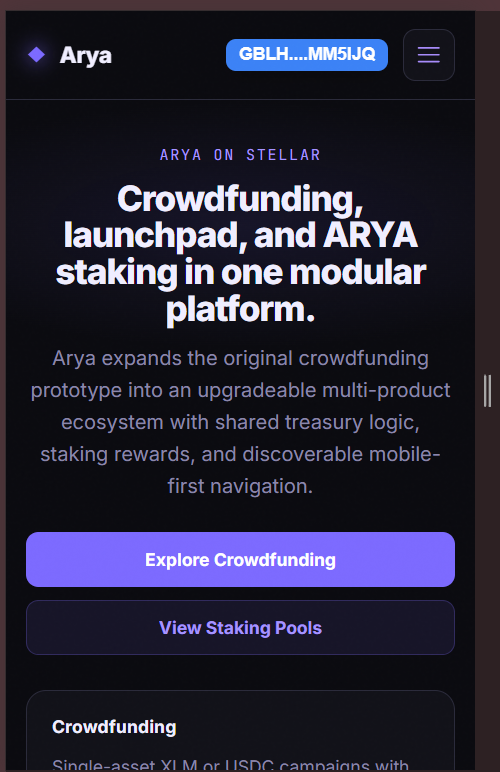

# Arya

Arya is a modular Stellar dApp platform built for Level 4 production-readiness work. It expands the original crowdfunding prototype into a broader product suite with upgradeable Soroban smart contracts, a React frontend, real-time event syncing, CI/CD, and mobile-first navigation.

- Network: `Stellar Testnet`
- Live Demo: `ADD_VERCEL_URL_HERE`
- Demo Video: `ADD_VIDEO_URL_HERE`
- Repository: <https://github.com/iammrjude/arya-risein>

## Modules

- Crowdfunding
- Launchpad
- Staking
- Admin

Coming soon:

- Leveraged staking

## Screenshots

Add screenshots in the `screenshots/` folder and replace the placeholder filenames below.

### Mobile Responsive View


*Show the mobile navigation, module tabs, and a complete page rendered on a narrow screen.*

### Home Page


*The Arya landing page introducing crowdfunding, launchpad, staking, and platform status.*

### Crowdfunding Explore


*The crowdfunding browse page showing campaigns, progress cards, and responsive layout.*

### Launchpad Explore


*The launchpad browse page showing sales, project metadata, and status information.*

### Staking Dashboard


*The staking area showing reward pools, balances, and user-facing staking actions.*

### CI/CD Pipeline


*A screenshot or badge proving the CI pipeline passed after the latest push.*

### Contract Test Output


*Rust test output showing the contract workspace tests passing.*

## How It Works

1. Crowdfunding campaigns accept exactly one asset: `XLM` or `USDC`.
2. Launchpad sales also accept exactly one asset: `XLM` or `USDC`.
3. ARYA is the staking asset. Users stake ARYA to earn platform rewards.
4. When crowdfunding or launchpad collects protocol fees, the fee is split automatically:
   - part to treasury
   - part to staking rewards
5. Staking keeps separate reward pools for `XLM` and `USDC`.
6. Registry stores the live contract addresses and shared protocol configuration.
7. All new contracts expose an `upgrade` entrypoint for safe testnet iteration.

## Advanced Production Features

- Upgradeable Soroban contracts
- Inter-contract reward routing from crowdfunding and launchpad into staking
- Real-time frontend event syncing through Soroban RPC event polling
- Mobile-first responsive navigation
- CI/CD with Rust and frontend validation
- Error reporting hook in the frontend
- Wasm build verification for deployable contracts

## Repository Structure

```text
arya-risein/
├── contract/
│   ├── contracts/
│   │   ├── arya_fund/           # legacy baseline contract kept for migration context
│   │   ├── arya_registry/       # shared address registry and config
│   │   ├── arya_staking/        # ARYA staking with XLM and USDC reward pools
│   │   ├── arya_crowdfunding/   # single-asset campaigns + staking fee split
│   │   └── arya_launchpad/      # single-asset sales + staking fee split
│   ├── scripts/
│   │   ├── build-all.ps1
│   │   ├── deploy-testnet.ps1
│   │   ├── init-testnet.ps1
│   │   └── upgrade-testnet.ps1
│   └── README.md
├── docs/
│   ├── ARCHITECTURE.md
│   ├── DEPLOYMENT.md
│   ├── UPGRADES.md
│   ├── MIGRATIONS.md
│   ├── TESTNET_SETUP.md
│   ├── FRONTEND_CONFIGURATION.md
│   ├── FEE_FLOW.md
│   ├── STAKING_DESIGN.md
│   ├── LAUNCHPAD_DESIGN.md
│   └── SECURITY_MODEL.md
├── frontend/
│   ├── src/
│   │   ├── app/
│   │   ├── components/
│   │   ├── contract/
│   │   ├── hooks/
│   │   ├── modules/
│   │   └── lib/
│   └── README.md
├── screenshots/
└── CONTRIBUTING.md
```

## Contracts

| Property | Value |
| ---------- | ------- |
| Network | Stellar Testnet |
| Registry Contract | `ADD_REGISTRY_ID_HERE` |
| Staking Contract | `ADD_STAKING_ID_HERE` |
| Crowdfunding Contract | `ADD_CROWDFUNDING_ID_HERE` |
| Launchpad Contract | `ADD_LAUNCHPAD_ID_HERE` |
| ARYA Token / SAC | `ADD_ARYA_TOKEN_ID_HERE` |
| Native XLM SAC | `ADD_XLM_SAC_ID_HERE` |
| Testnet USDC SAC | `ADD_USDC_SAC_ID_HERE` |
| Treasury Wallet | `ADD_TREASURY_ADDRESS_HERE` |
| Platform Owner | `ADD_OWNER_ADDRESS_HERE` |

### Deployment / Upgrade Transactions

| Action | Transaction Hash |
| ---------- | ---------------- |
| Registry Deploy | `ADD_TX_HASH_HERE` |
| Registry Initialize | `ADD_TX_HASH_HERE` |
| Staking Deploy | `ADD_TX_HASH_HERE` |
| Staking Initialize | `ADD_TX_HASH_HERE` |
| Crowdfunding Deploy | `ADD_TX_HASH_HERE` |
| Crowdfunding Initialize | `ADD_TX_HASH_HERE` |
| Launchpad Deploy | `ADD_TX_HASH_HERE` |
| Launchpad Initialize | `ADD_TX_HASH_HERE` |
| Latest Upgrade | `ADD_TX_HASH_HERE` |

### Inter-Contract Call Verification

| Action | Transaction |
| ---------- | ------------ |
| Crowdfunding fee routed into staking | `ADD_TX_HASH_OR_EXPLORER_LINK` |
| Launchpad fee routed into staking | `ADD_TX_HASH_OR_EXPLORER_LINK` |

### Token / Pool

| Asset | Address |
| ---------- | ------- |
| ARYA token / SAC | `ADD_TOKEN_ID_HERE` |
| ARYA/XLM pool (optional) | `ADD_POOL_ID_HERE` |

## Tech Stack

### Contract Workspace

- Rust
- Soroban SDK `25`
- Stellar CLI `25.1.0`
- `wasm32v1-none`

### Frontend

- React `19`
- React Router `7`
- Vite `7`
- `@stellar/stellar-sdk`
- `@creit-tech/stellar-wallets-kit`
- CSS Modules

## Local Development

### Smart Contracts

```bash
cd contract
cargo fmt --all -- --check
cargo clippy --workspace --all-targets --all-features -- -D warnings
cargo test --workspace
```

Build deployable Wasm:

```powershell
C:\Windows\System32\WindowsPowerShell\v1.0\powershell.exe -ExecutionPolicy Bypass -File scripts/build-all.ps1
```

### Frontend App

```bash
cd frontend
npm ci
npm run lint
npm run build
npm run dev
```

## Documentation

- [contract/README.md](contract/README.md)
- [frontend/README.md](frontend/README.md)
- [docs/DEPLOYMENT.md](docs/DEPLOYMENT.md)
- [docs/UPGRADES.md](docs/UPGRADES.md)
- [docs/MIGRATIONS.md](docs/MIGRATIONS.md)
- [docs/TESTNET_SETUP.md](docs/TESTNET_SETUP.md)
- [docs/FRONTEND_CONFIGURATION.md](docs/FRONTEND_CONFIGURATION.md)
- [docs/ARCHITECTURE.md](docs/ARCHITECTURE.md)

## CI/CD

GitHub Actions workflows:

- [ci.yml](.github/workflows/ci.yml)
  Runs Rust format, clippy, tests, Wasm builds, and frontend lint/build.
- [testnet-deploy.yml](.github/workflows/testnet-deploy.yml)
  Supports testnet deploy or upgrade when secrets are configured.

Add a badge or screenshot here after the first passing run.

### GitHub Actions Variables

`ci.yml` does not require custom secrets for normal validation. It only needs the repository code.

`testnet-deploy.yml` does require GitHub Actions secrets. In GitHub:

1. open your repository
2. go to `Settings`
3. go to `Secrets and variables` -> `Actions`
4. add the signing key as a repository secret
5. add the public configuration values as repository variables

GitHub Actions Secret:

- `STELLAR_ACCOUNT`
  Set this to a signing key the CLI can use on the runner. In GitHub Actions, the safest practical value is your Stellar secret key beginning with `SC...`, not a local alias like `arya-admin`.

GitHub Actions Variables:

- `STELLAR_RPC_URL`
  Set to `https://soroban-testnet.stellar.org`
- `STELLAR_NETWORK_PASSPHRASE`
  Set to `Test SDF Network ; September 2015`
- `ARYA_PLATFORM_OWNER`
  The public Stellar address `G...` that should own the Arya contracts.
- `ARYA_TREASURY`
  The treasury public Stellar address `G...`.
- `ARYA_USDC_SAC_ID`
  The USDC Stellar Asset Contract ID `C...` used on your testnet setup.

Needed only for `upgrade` mode as variables:

- `ARYA_EXISTING_REGISTRY_ID`
- `ARYA_EXISTING_STAKING_ID`
- `ARYA_EXISTING_CROWDFUNDING_ID`
- `ARYA_EXISTING_LAUNCHPAD_ID`

Recommended additional variable for later operational use:

- `ARYA_TOKEN_SAC_ID`
  Your ARYA token Stellar Asset Contract ID, useful for init/deploy docs and future workflow expansion.
- `ARYA_XLM_SAC_ID`
  Optional override for the native XLM SAC if you want to provide it explicitly.

Important notes:

- never put secret keys in normal repository variables or commit them to the repo
- only store signing material in GitHub Actions `Secrets`
- use GitHub Actions `Variables` for public addresses, contract IDs, RPC URLs, and passphrases
- the current `testnet-deploy.yml` validates, builds, and then deploys or upgrades contract Wasm; contract initialization is documented separately in the contract README and deployment docs

## Submission Checklist

- [x] Public GitHub repository
- [x] 8+ meaningful commits
- [x] Upgradeable contracts
- [x] Inter-contract calls
- [x] Mobile-responsive frontend
- [x] Real-time event stream hook
- [x] CI/CD workflows configured
- [ ] Live demo URL filled in
- [ ] Screenshots added
- [ ] Contract addresses added
- [ ] Transaction hashes added
- [ ] Token / pool address added if deployed

## Contributing

Please read [CONTRIBUTING.md](CONTRIBUTING.md) before opening a pull request.
