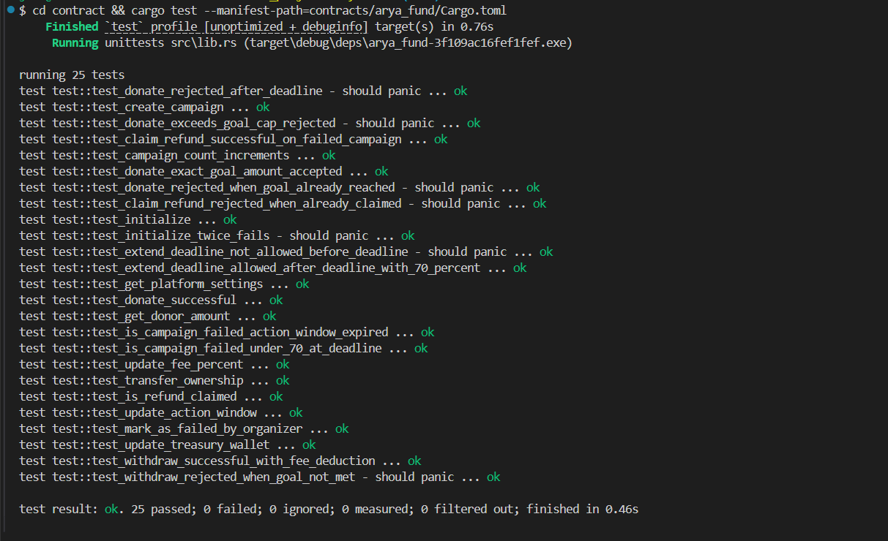

# AryaFund — Decentralized Crowdfunding on Stellar

A trustless crowdfunding smart contract built on the Stellar network using Soroban. Anyone can create campaigns, collect XLM donations, and receive automatic refunds if goals are not met — all enforced by on-chain rules with no middleman.

---

## Live Demo

> Frontend: <https://arya-crowdfund.vercel.app>

---

## Contract Details

| Property | Value |
| ---------- | ------- |
| **Network** | Stellar Testnet |
| **Contract Address** | `CD5LOATI5SDME7GQXRBVSZIG3DZL4NRYD4663GM7PLPY252L2RGPOFTL` |
| **Wasm Hash** | `486ee96c78bac0ba19b698d8a808caf59fd36c19b05d0f71ab2b363596afef8d` |
| **Native XLM SAC** | `CDLZFC3SYJYDZT7K67VZ75HPJVIEUVNIXF47ZG2FB2RMQQVU2HHGCYSC` |
| **Platform Owner** | `GBLH7QUEY43J3AJSIYPRUQKKUFX577GSYWRRQJVNFOV7MUON3YMM5IJQ` |
| **Treasury Wallet** | `GAZZRHDL3SUTFD2CWWDVVHQXGVXWWQYTJNGMC6IQIQD7OAKQLDBJND7B` |
| **Platform Fee** | 2.5% (250 basis points) |
| **Action Window** | 7 days |

### Key Transactions

| Event | Transaction Hash |
| ------- | ----------------- |
| Deploy | `95478ead278154ae67b279cdce1492715f2e37079d5ed41253710dbc017e2ab6` |
| Initialize | `8e29274c189a60e436da4d2c8aa807a3472ecc7584ad69a6891286312b69e64b` |

### Verified Contract Calls

| Action | Transaction |
| -------- | ------------- |
| Create Campaign (1000 XLM goal) | [`aed99ba9...`](https://stellar.expert/explorer/testnet/tx/aed99ba9f25edd405b96baf142e1fb77dd6c3f388b53f0a3c66188ca7457bd47) |
| Donate 120 XLM | [`ca0e0fd7...`](https://stellar.expert/explorer/testnet/tx/ca0e0fd7ebc7b446ac4d0b7de8e6164490cb343bb5a59c6d8c5c3e3262c78599) |
| Donate 500 XLM | [`970d73e8...`](https://stellar.expert/explorer/testnet/tx/970d73e8cf8c5aba408e1da4b1a2cb9c2141c123d69bff8b11a0bb7ca607208a) |
| Donate 80 XLM | [`98020ff7...`](https://stellar.expert/explorer/testnet/tx/98020ff70c1d55eb0855efed99fe0511f85a5c50d0e1a8b051bf699b890b4ea0) |
| Donate 300 XLM | [`27c954cd...`](https://stellar.expert/explorer/testnet/tx/27c954cde49216022b05caa7bf4ebb802f570ee1b8fe55b9d27dec0580a5f853) |
| Update Fee to 2% | [`4586967e...`](https://stellar.expert/explorer/testnet/tx/4586967eff85adcf713a2441a1d122030343eac5f2a5c2b6d5edb69e8940ebd5) |
| Update Action Window to 5 days | [`4f4691ed...`](https://stellar.expert/explorer/testnet/tx/4f4691ed1ed72b78977348c6ffc023888bc1820dce30c0a8408f4f5b1f0c4f0e) |

---

## Project Structure

```text
contract/
├── contracts/
│   └── arya_fund/
│       ├── src/
│       │   ├── lib.rs        # Main contract logic (17 exported functions)
│       │   └── test.rs       # 25 unit tests
│       └── Cargo.toml
├── Cargo.toml
└── README.md
```

---

## How It Works

### Funding Rules

**Rule 1 — Goal Met:**

Organizer calls `withdraw()`. Contract deducts 2.5% platform fee to treasury, remainder goes to organizer.

**Rule 2 — 70%+ Raised, Deadline Passed:**

A 7-day action window opens. Organizer can:

- `extend_deadline()` — one-time extension by `extension_days` set at campaign creation
- `mark_as_failed()` — voluntarily end the campaign

If no action is taken within the window, the campaign auto-fails.

**Rule 3 — Campaign Fails:**

Triggered when:

- Less than 70% raised at deadline
- Extended deadline passes with goal not met
- Action window expires with no action taken
- Organizer manually marks it failed

Donors can then call `claim_refund()` to receive their exact contribution back.

---

## Exported Functions (17)

### Public

| Function | Description |
| ---------- | ------------- |
| `create_campaign` | Create a new campaign |
| `donate` | Donate XLM to a campaign |
| `claim_refund` | Claim refund on a failed campaign |

### Organizer

| Function | Description |
| ---------- | ------------- |
| `withdraw` | Withdraw funds from a successful campaign |
| `extend_deadline` | Extend deadline (one-time, 70%+ raised only) |
| `mark_as_failed` | Voluntarily mark campaign as failed |

### Platform Owner

| Function | Description |
| ---------- | ------------- |
| `initialize` | One-time contract setup |
| `update_fee_percent` | Update platform fee in basis points |
| `update_treasury_wallet` | Update treasury wallet address |
| `update_action_window` | Update action window duration |
| `transfer_ownership` | Transfer platform ownership |

### Read Only

| Function | Description |
| ---------- | ------------- |
| `get_campaign` | Get campaign by ID |
| `get_campaign_count` | Get total number of campaigns |
| `get_donor_amount` | Get donor's contribution to a campaign |
| `get_platform_settings` | Get platform configuration |
| `is_campaign_failed` | Check if a campaign has failed |
| `is_refund_claimed` | Check if a donor has claimed their refund |

---

## Development Setup

### Prerequisites

- Rust `1.84.0+`
- Stellar CLI `v25.1.0`
- `wasm32v1-none` target

```bash
rustup target add wasm32v1-none
```

### Build

```bash
stellar contract build
```

Output: `target/wasm32v1-none/release/arya_fund.wasm`

### Test

```bash
cargo test --manifest-path=contracts/arya_fund/Cargo.toml
```

#### Test Output


*All 25 unit tests passing covering all 17 exported contract functions*

All 25 tests should pass:

```bash
test result: ok. 25 passed; 0 failed; 0 ignored; 0 measured; 0 filtered out; finished in 0.46s
```

### Deploy

```bash
stellar contract deploy \
  --wasm target/wasm32v1-none/release/arya_fund.wasm \
  --source YOUR_KEY_NAME \
  --network testnet
```

### Initialize

```bash
stellar contract invoke \
  --id CONTRACT_ADDRESS \
  --source YOUR_KEY_NAME \
  --network testnet \
  -- initialize \
  --platform_owner YOUR_OWNER_ADDRESS \
  --treasury_wallet YOUR_TREASURY_ADDRESS \
  --fee_basis_points 250 \
  --action_window_days 7 \
  --native_token CDLZFC3SYJYDZT7K67VZ75HPJVIEUVNIXF47ZG2FB2RMQQVU2HHGCYSC
```

---

## Data Structures

```rust
Campaign {
    id: u32,
    title: String,
    description: String,
    goal_amount: i128,       // in stroops (1 XLM = 10,000,000 stroops)
    deadline: u64,           // Unix timestamp
    extension_days: u32,
    extension_used: bool,
    total_raised: i128,
    organizer: Address,
    status: CampaignStatus,  // Active | Successful | Failed
}

PlatformSettings {
    platform_owner: Address,
    treasury_wallet: Address,
    fee_basis_points: u32,   // 250 = 2.5%
    action_window_days: u32,
    native_token: Address,
}
```

---

## Security Design

- **No custodian risk** — funds held by contract, not organizer
- **Pull refunds** — donors claim refunds themselves, no double claiming
- **Separated wallets** — platform owner and treasury are separate addresses
- **On-chain rules** — all funding logic enforced by smart contract
- **Authorization** — every write function requires `.require_auth()` from the appropriate party

---

## Built With

- [Soroban SDK](https://soroban.stellar.org) — Stellar smart contract framework
- [Stellar CLI](https://github.com/stellar/stellar-cli) — Contract build and deployment
- [Rust](https://www.rust-lang.org) — Smart contract language
