# AryaFund — Frontend

The React frontend for AryaFund, a decentralized crowdfunding dApp built on the Stellar network.

---

## Live Demo

> <https://arya-crowdfund.vercel.app>

---

## Screenshots

### Home Page — Wallet Not Connected

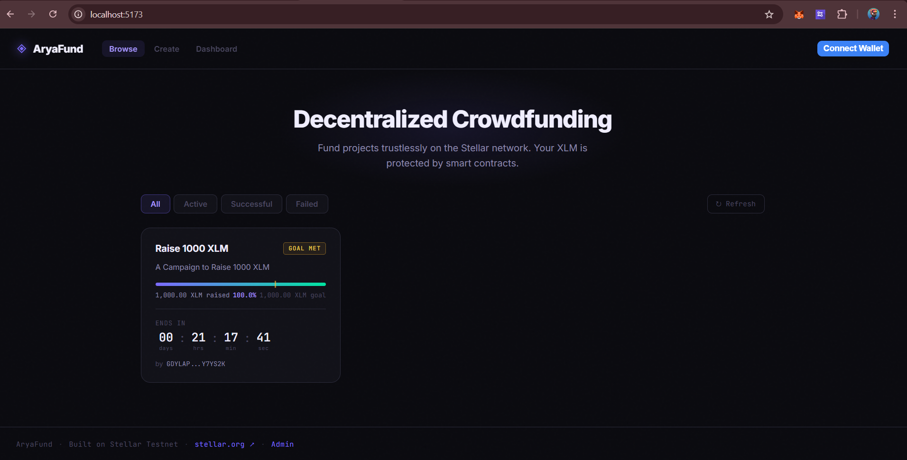
*The home page as seen by a first-time visitor with no wallet connected. Campaign cards are visible and browsable without needing to connect a wallet.*

### Home Page — Wallet Connection Modal

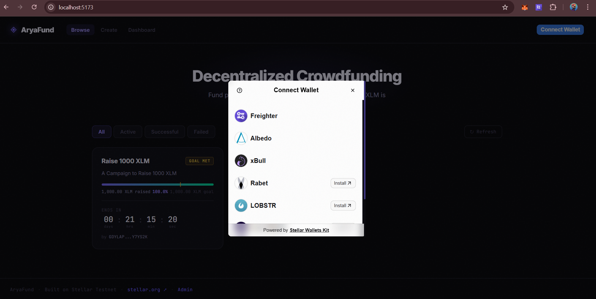
*Clicking the Connect Wallet button opens the Stellar Wallets Kit modal, showing all supported wallets — Freighter, Albedo, xBull, Rabet, and LOBSTR.*

### Home Page — Wallet Connected

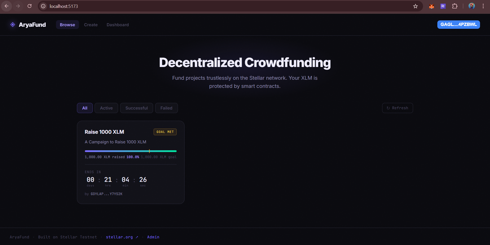
*The home page after successfully connecting a wallet. The connected address is displayed in the top right corner.*

### Create Campaign Page

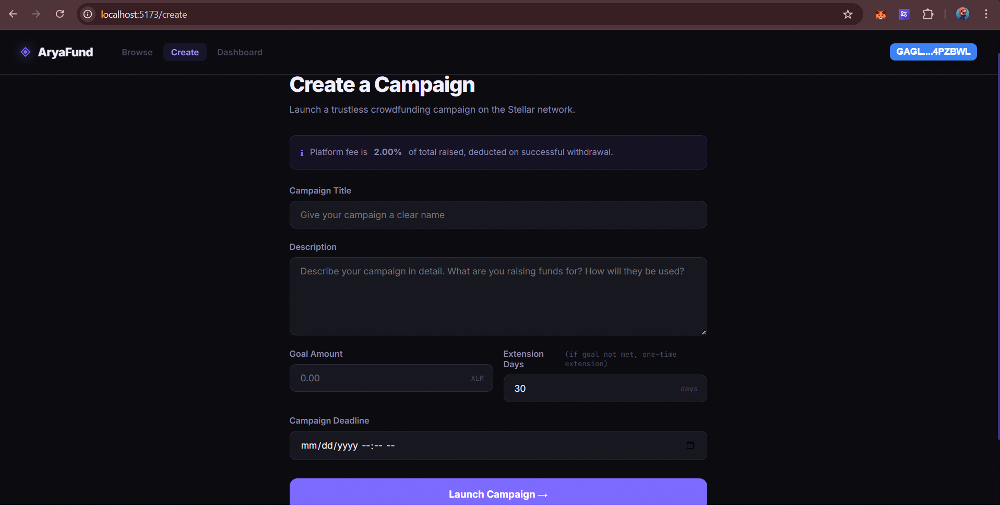
*The campaign creation form where organizers can set a title, description, funding goal, deadline, and extension days.*

### Campaign Page — Active

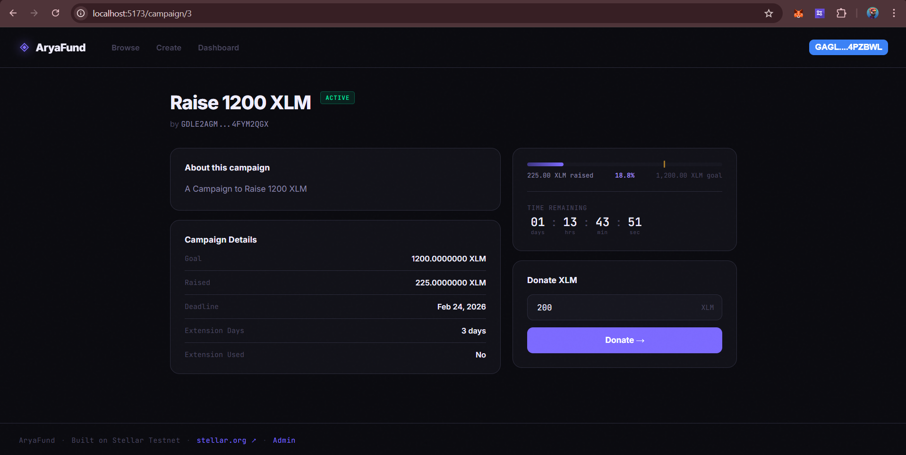
*A campaign that is active, goal has not been met and the deadline has not passed. The donate form is available and users can donate by typing the amount they want to donate.*

### Campaign Page — Goal Reached

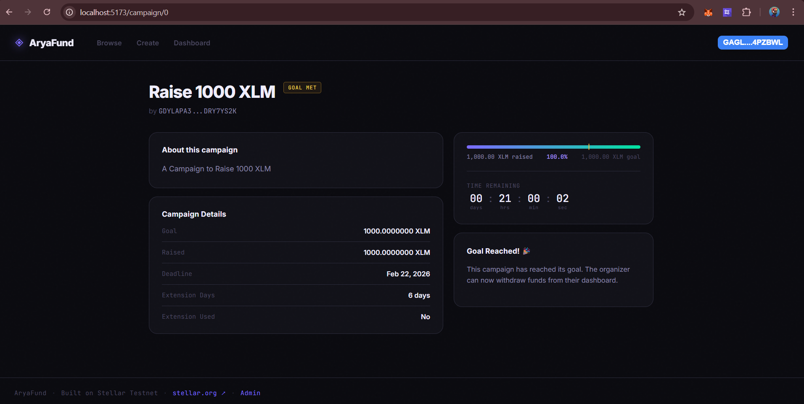
*A campaign that has reached 100% of its funding goal. The donate form is replaced with a Goal Reached message, and the organizer can now withdraw funds from their dashboard.*

### Campaign Page — Successful

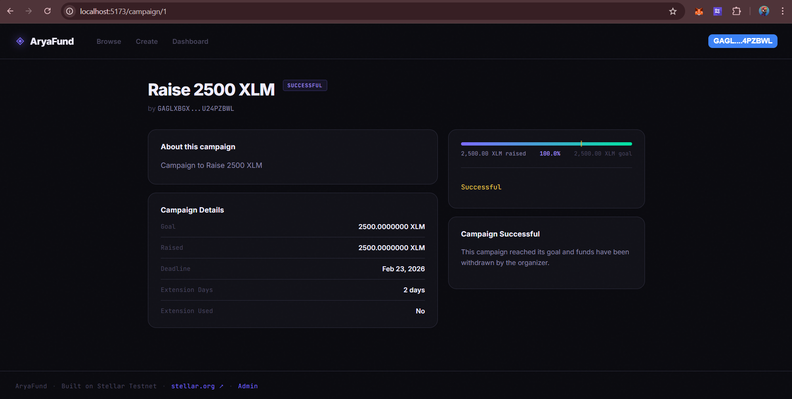
*A campaign that has reached 100% of its funding goal. The donate form is replaced with a Campaign Successful message, which means that funds have been withdrawn by the organizer.*

### Dashboard — No Campaigns

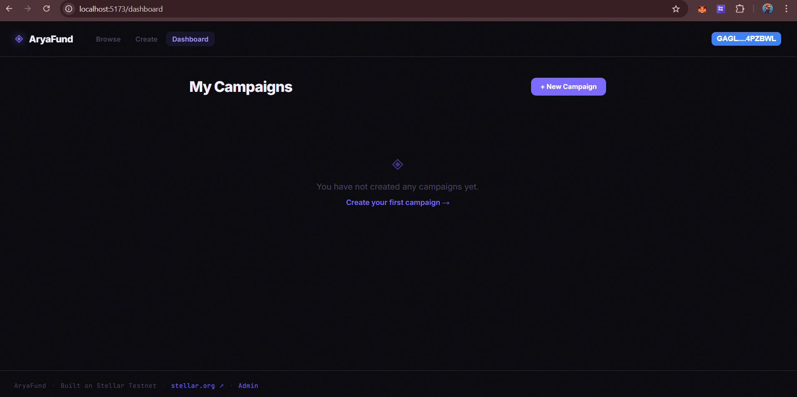
*The organizer dashboard when the connected wallet has not yet created any campaigns.*

### Dashboard — With Campaigns

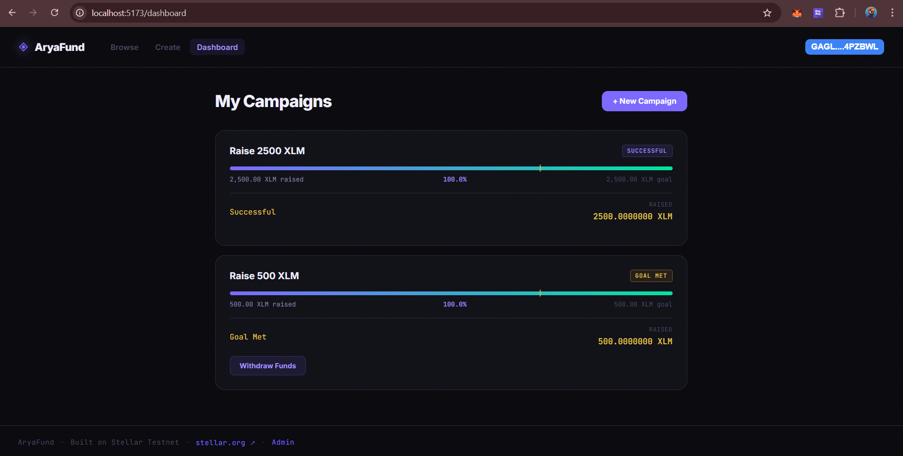
*The organizer dashboard when the connected wallet has created one or more campaigns.*

### Admin Page — Wallet Disconnected

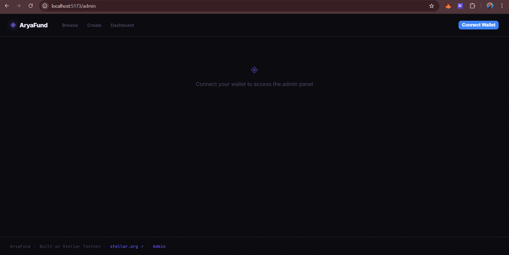
*The admin page when the user has not yet connected their wallet. It prompts the user to connect their wallet to access the admin panel.*

### Admin Page — Access Denied

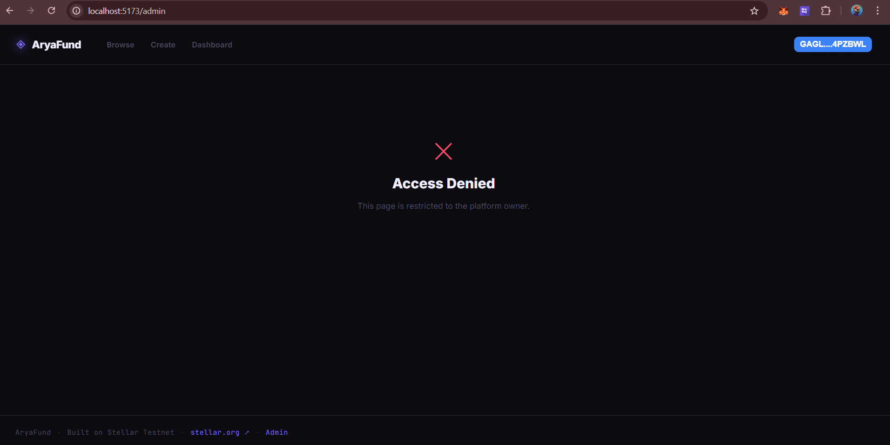
*The admin page when accessed by a wallet that is not the platform owner. Access is restricted to protect platform settings.*

### Admin Page — Admin Panel

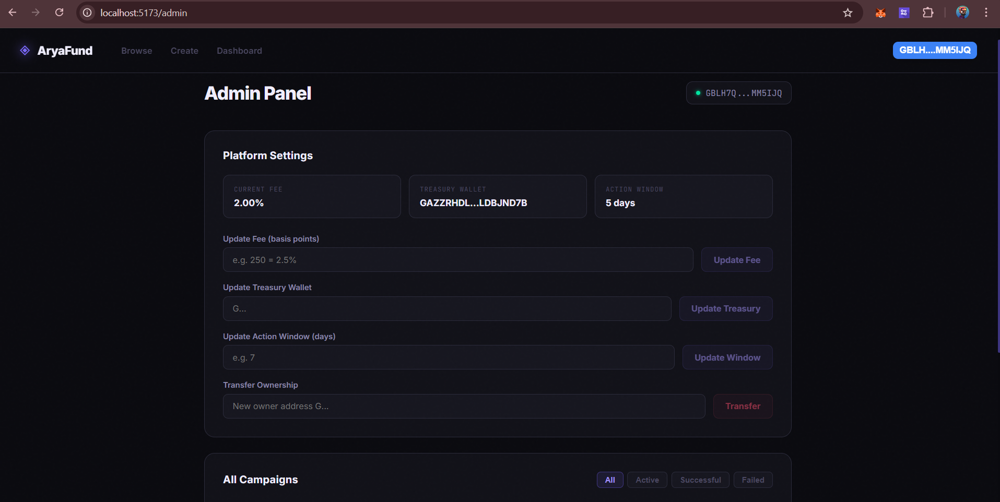
*The admin page when accessed by the platform owner's wallet. It shows the Platform Settings card - which shows the settings that the platform owner can update. It also shows the All Campaigns card - which shows all the campaigns on the platform.*

---

## Tech Stack

| Tool | Purpose |
| ------ | --------- |
| React 19 + Vite | UI framework and build tool |
| React Router v7 | Client-side routing |
| `@stellar/stellar-sdk` | Soroban contract interaction |
| `@creit-tech/stellar-wallets-kit` | Multi-wallet connection (Freighter, Albedo, xBull, Rabet, LOBSTR) |
| CSS Modules | Component-scoped styling |
| Inter + JetBrains Mono | Typography |

---

## Contract

| Property | Value |
| ---------- | ------- |
| **Network** | Stellar Testnet |
| **Contract Address** | `CD5LOATI5SDME7GQXRBVSZIG3DZL4NRYD4663GM7PLPY252L2RGPOFTL` |
| **Deploy TX** | [`95478ead278154ae67b279cdce1492715f2e37079d5ed41253710dbc017e2ab6`](https://stellar.expert/explorer/testnet/tx/95478ead278154ae67b279cdce1492715f2e37079d5ed41253710dbc017e2ab6) |

### Verified Contract Calls

| Action | Transaction |
| -------- | ------------- |
| Create Campaign (1000 XLM goal) | [`aed99ba9...`](https://stellar.expert/explorer/testnet/tx/aed99ba9f25edd405b96baf142e1fb77dd6c3f388b53f0a3c66188ca7457bd47) |
| Donate 120 XLM | [`ca0e0fd7...`](https://stellar.expert/explorer/testnet/tx/ca0e0fd7ebc7b446ac4d0b7de8e6164490cb343bb5a59c6d8c5c3e3262c78599) |
| Donate 500 XLM | [`970d73e8...`](https://stellar.expert/explorer/testnet/tx/970d73e8cf8c5aba408e1da4b1a2cb9c2141c123d69bff8b11a0bb7ca607208a) |
| Donate 80 XLM | [`98020ff7...`](https://stellar.expert/explorer/testnet/tx/98020ff70c1d55eb0855efed99fe0511f85a5c50d0e1a8b051bf699b890b4ea0) |
| Donate 300 XLM | [`27c954cd...`](https://stellar.expert/explorer/testnet/tx/27c954cde49216022b05caa7bf4ebb802f570ee1b8fe55b9d27dec0580a5f853) |
| Update Fee to 2% | [`4586967e...`](https://stellar.expert/explorer/testnet/tx/4586967eff85adcf713a2441a1d122030343eac5f2a5c2b6d5edb69e8940ebd5) |
| Update Action Window to 5 days | [`4f4691ed...`](https://stellar.expert/explorer/testnet/tx/4f4691ed1ed72b78977348c6ffc023888bc1820dce30c0a8408f4f5b1f0c4f0e) |

---

## Pages

| Route | Description |
| ------- | ------------- |
| `/` | Browse all campaigns with status filters |
| `/campaign/:id` | Campaign detail, donate, claim refund |
| `/create` | Create a new campaign |
| `/dashboard` | Manage your own campaigns (withdraw, extend, mark failed) |
| `/admin` | Platform owner settings (fee, treasury, action window) |

---

## Getting Started

### Prerequisites

- Node.js `v22+`
- A Stellar wallet extension (Freighter recommended for testnet)

### Install

```bash
npm install
```

### Run locally

```bash
npm run dev
```

Opens at `http://localhost:5173`

### Build for production

```bash
npm run build
```

---

## Environment

No `.env` file needed. All configuration is in `src/contract/config.js`:

```js
import { Networks } from '@stellar/stellar-sdk'

export const CONTRACT_ID = 'CD5LOATI5SDME7GQXRBVSZIG3DZL4NRYD4663GM7PLPY252L2RGPOFTL'
export const NATIVE_TOKEN_ID = 'CDLZFC3SYJYDZT7K67VZ75HPJVIEUVNIXF47ZG2FB2RMQQVU2HHGCYSC'
export const NETWORK_PASSPHRASE = Networks.TESTNET
export const RPC_URL = 'https://soroban-testnet.stellar.org'
export const PLATFORM_OWNER = 'GBLH7QUEY43J3AJSIYPRUQKKUFX577GSYWRRQJVNFOV7MUON3YMM5IJQ'
export const READ_ACCOUNT = 'GBLH7QUEY43J3AJSIYPRUQKKUFX577GSYWRRQJVNFOV7MUON3YMM5IJQ'
```

---

## Project Structure

```text
src/
├── contract/
│   ├── config.js          # Contract address, network config
│   └── client.js          # All contract function calls
│
├── hooks/
│   ├── useWallet.js       # getAddress, signTransaction
│   └── useContract.js     # useCampaigns, useCampaign, usePlatformSettings
│
├── utils/
│   ├── stellar.js         # truncateAddress, explorerUrl
│   ├── format.js          # XLM/stroops conversion, fee calculation
│   └── time.js            # Unix timestamps, countdown, action window
│
├── components/
│   ├── Header/
│   ├── Footer/
│   ├── CampaignCard/
│   ├── ProgressBar/
│   ├── CountdownTimer/
│   ├── StatusBadge/
│   ├── TxStatus/
│   └── ConnectPrompt/
│
└── pages/
    ├── Home/
    ├── Campaign/
    ├── Create/
    ├── Dashboard/
    └── Admin/
```

---

## Features

- Browse campaigns filtered by status (Active, Successful, Failed)
- Create campaigns with goal, deadline and extension days
- Donate XLM to active campaigns
- Auto-refund for failed campaigns — donors claim directly
- Organizer dashboard — withdraw funds, extend deadline, mark as failed
- Platform admin panel — update fee, treasury wallet, action window
- Real-time countdown timers and progress bars
- Transaction status feedback with Stellar Explorer links
- Multi-wallet support via Stellar Wallets Kit

---

## Related

- [Smart Contract README](../contract/README.md)
- [Stellar Wallets Kit](https://github.com/Creit-Tech/Stellar-Wallets-Kit)
- [Soroban Docs](https://soroban.stellar.org)
- [Stellar Expert (Testnet)](https://stellar.expert/explorer/testnet)
